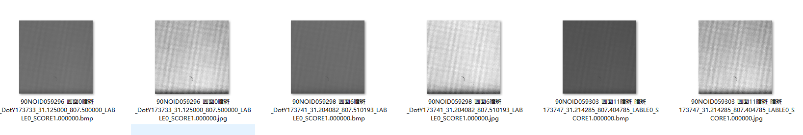
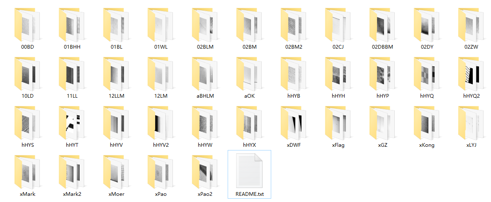
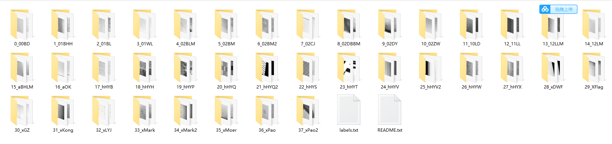

# 数据集制作过程

datetime：20210906

author：FelixFu

---

## 1、生成增强图
使用del-jpg.py文件，为每张图生成增强图，然后人工分类。
例如下图，将下面6张图划分为01WL文件夹下



## 2、合并不同时间节点的数据
例如将0NoTime、20210820、20210823三个文件夹中的数据合并成trainval文件夹，然后每一类数据进行均衡处理（即保证每一类的数据数量相近）。



## 3、重命名
(1). 编写labels.txt文件
```angular2html
0:00BD
1:01BHH
2:01BL
3:01WL
4:02BLM
5:02BM
6:02BM2
7:02CJ
8:02DBBM
9:02DY
10:02ZW
11:10LD
12:11LL
13:12LLM
14:12LM
15:aBHLM
16:aOK
17:hHYB
18:hHYH
19:hHYP
20:hHYQ
21:hHYQ2
22:hHYS
23:hHYT
24:hHYV
25:hHYV2
26:hHYW
27:hHYX
28:xDWF
29:XFlag
30:xGZ
31:xKong
32:xLYJ
33xMark
34:xMark2
35:xMoer
36:xPao
37:xPao2
```

(2). 重命名trainval文件夹下所有的文件夹，通过del-jpy.py文件中的rename_函数



(3). 运行data-split.py文件

```angular2html
    dirname = r"F:\Data\Screen\trainval_notime_20210820"
    # 1、重命名所有图片文件，将中文改成英文
    rename_all_images(dirname)
    # 2、将数据划分为train和val
    split_dataset(path=dirname, train_ratio=0.9)
    # 3、获得所有train图片的均值与方差
    gen_mean_std(root_path=dirname)
```
